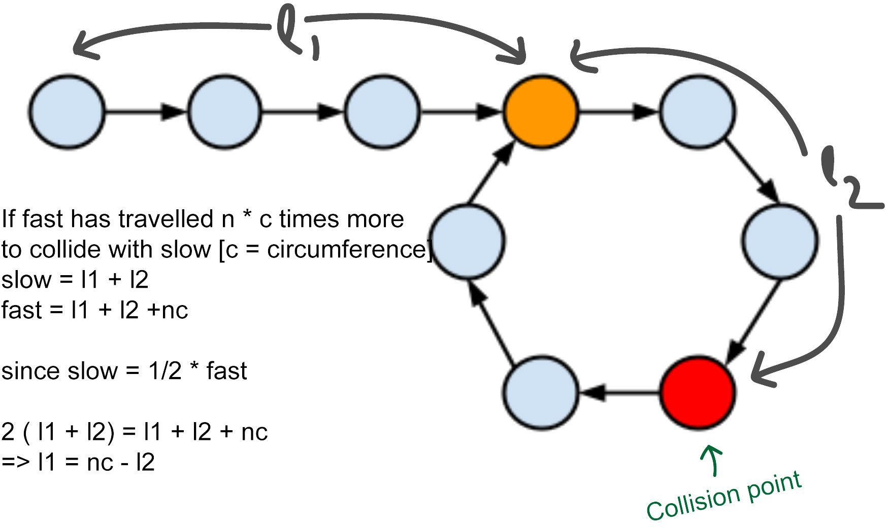

# Fast and slow pointers

The Fast & Slow pointer approach, also known as the Hare & Tortoise algorithm, is a pointer algorithm that uses two pointers which move through the array (or sequence/LinkedList) at different speeds. This approach is quite useful when dealing with cyclic LinkedLists or arrays. </br>

By moving at different speeds (say, in a cyclic LinkedList), the algorithm proves that the two pointers are bound to meet. The fast pointer should catch the slow pointer once both the pointers are in a cyclic loop.

## Table of contents

| No  | Difficulty | Fast slow pointers                                      |
| --- | ---------- | ------------------------------------------------------- |
| 01  | Easy       | [Linked list cycle](#linked-list-cycle)                 |
| 02  | Medium     | [Linked list cycle II](#linked-list-cycle-II)           |
| 03  | Easy       | [Middle of the linked list](#middle-of-the-linked-list) |
| 04  | Easy       | [Happy number](#happy-number)                           |

## Answers

### Linked list cycle

[Problem Link](https://leetcode.com/problems/linked-list-cycle/) <br/>
Question : Given head, the head of a linked list, determine if the linked list has a cycle in it.<br/>
Solution : We’ll take two pointers fast and slow both of them will be initialized with the head. Then we’ll increment the slow by one and the fast by two `slow = slow.next` , `fast = fast.next.next`. If the linked list has a cycle both pointers will collide. Otherwise we’ll run the loop until `fast is not None and fast.next is not None`

```python
def hasCycle(head):
    slow, fast = head, head

    while (fast != None and fast.next != None):
        slow = slow.next
        fast = fast.next.next
        if (slow == fast): return True

    return False
```

<br/>**[⬆ Back to Top](#table-of-contents)**

### Middle of the linked list

[Problem Link](https://leetcode.com/problems/middle-of-the-linked-list/) <br/>
Question : Given the head of a singly linked list, return the middle node of the linked list. If there are two middle nodes, return the second middle node.<br/>
Solution : If we move fast pointer twice the speed of slow pointer when the fast pointer points to None the slow pointer will point to the middle.

```python
def middleNode(head):
    slow, fast = head, head

    while fast is not None and fast.next is not None:
        slow = slow.next
        fast = fast.next.next

    return slow
```

<br/>**[⬆ Back to Top](#table-of-contents)**

### Linked list cycle II

[Problem Link](https://leetcode.com/problems/linked-list-cycle-ii/) <br/>
Question : Given the head of a linked list, return the node where the cycle begins. If there is no cycle, return null.<br/>
Solution : After finding the collision point like before we’ll move fast pointer and entry pointer [initialized as head] by one and the point of their collision will be the answer.
</br>

```python
def detectCycle(head):
    slow, fast, entry = head, head, head

    while fast is not None and fast.next is not None:
        slow = slow.next
        fast = fast.next.next
        if fast == slow:
            while entry != fast:
                fast = fast.next
                entry = entry.next
            return entry

    return None
```



<br/>**[⬆ Back to Top](#table-of-contents)**

### Happy number

[Problem Link](https://leetcode.com/problems/happy-number/) <br/>
Question : Visit the problem link.<br/>
Solution : Before using the fast-slow pointer method it’s better to know this method as well. sumOfSquares(34) -> 25 `[ 3^2 + 4^2 ]`. After continuously calculating the sum of squares, If we get 1 then the given number is happy or if we get back to any sum of squares calculated before then we can conclude the number is not a happy number

```python
class Solution:
    def isHappy(self, n):
        visit = set()

        while n not in visit:
            visit.add(n)
            n = self.sumOfSquares(n)
            if n == 1: return True

        return False

    def sumOfSquares(self, n):
        output = 0

        while n:
            lastDigit = n % 10
            output += lastDigit ** 2
            n = n // 10 # returns the second last digit

        return output
```

Fast-slow-pointer method : We’ll use one fast and one slow pointer and our next node will point to sumOfSquares(n)

```python
class Solution:
    def isHappy(self, n):
        slow , fast = n , n

        while True:
            slow = self.sumOfSquares(slow)
            fast = self.sumOfSquares(self.sumOfSquares(fast))

            if fast == slow: break

        return fast == 1

    def sumOfSquares(self, n):
        output = 0

        while n:
            lastDigit = n % 10
            output += lastDigit ** 2
            n = n // 10 # returns the second last digit

        return output
```

<br/>**[⬆ Back to Top](#table-of-contents)**
