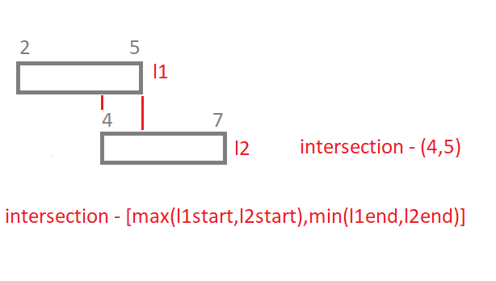

# Merge intervals

This pattern describes an efficient technique to deal with overlapping intervals. In a lot of problems involving intervals, we either need to find overlapping intervals or merge intervals if they overlap.

## Table of contents

| No  | Difficulty | `Merge intervals`                                     |
| --- | ---------- | ----------------------------------------------------- |
| 01  | Medium     | [Merge intervals](#merge-intervals)                   |
| 02  | Hard       | [Insert intervals](#insert-intervals)                 |
| 03  | Medium     | [Intervals intersection](#intervals-intersection)     |
| 04  | Medium     | [Conflicting appointments](#conflicting-appointments) |

## Answers

### Merge intervals

[Problem Link](https://leetcode.com/problems/merge-intervals/) <br/>
Question : Given a list of intervals, merge all the overlapping intervals to produce a list that has only mutually exclusive intervals. <br/>
Solution : First, we’ll sort the given intervals by their starting value. We’ll create an output array of intervals initialized with the first interval `output = [ intervals[0] ]`. We’ll loop through the intervals from index 1 (0th is already in the output). If the current interval’s start < the output’s last interval’s end that means it’ll merge.

```python
def merge(intervals):
    intervals.sort(key = lambda i:i[0])
    output = [intervals[0]]

    for start, end in intervals[1:]:
        outputLastElement = output[-1][1]

        if start < outputLastElement:
            output[-1][1] = max(outputLastElement, end)
        else:
            output.append([start,end])

    return output
```

<br/>**[⬆ Back to Top](#table-of-contents)**

### Insert intervals

[Problem Link](https://leetcode.com/problems/insert-interval/) <br/>
Question : Given a list of intervals, merge all the overlapping intervals to produce a list that has only mutually exclusive intervals. Insert newInterval into intervals such that intervals is still sorted in ascending order by starti and intervals still does not have any overlapping intervals (merge overlapping intervals if necessary).<br/>
Solution : While looping through the intervals we’ll see if the new interval goes behind the current interval or goes after the interval if neither of these is true we can conclude it’s overlapping. </br> At any point if we found the new interval goes behind the current interval, then the new interval will not overlap with any upcoming interval (since intervals are sorted) we’ll return the new interval + the rest of the intervals. <br/> At any point If we found new intervals go after the current intervals we’ll append the current interval to the res.<br/> Else current interval and new intervals are overlapping. At the end if we don’t return from 1st conditional statement we’ll have to make sure that we append the new interval to res before returning it.

```python
def insert(intervals, newInterval):
    res = []

    for i in range(len(intervals)):
        if newInterval[1] < intervals[i][0]:
            res.append(newInterval)
            return res + intervals[i:]

        elif newInterval[0] > intervals[i][1]:
            res.append(intervals[i])

        else:
            newInterval = [min(intervals[i][0],newInterval[0]), max(intervals[i][1],newInterval[1])]

    res.append(newInterval)
    return res
```

<br/>**[⬆ Back to Top](#table-of-contents)**

### Intervals intersection

[Problem Link](https://leetcode.com/problems/interval-list-intersections/) <br/>
Question : Given two lists of intervals, find the intersection of these two lists. Each list consists of disjoint intervals sorted on their start time. <br/>
Solution : We’ll try to find the possible common-start and common-end from both lists. If the result is invalid (common-end < common-start) we won’t add the interval to the result. Also, we’ll use two-pointers to traverse through the lists we’ll increment the pointer which’s end is lesser than the other. In the image the intersection is [common-start, common-end]

```python
def intervalIntersection(firstList, secondList):
    first, second = 0, 0
    ans = []

    while first < len(firstList) and second < len(secondList):
        commonStart = max(firstList[first][0], secondList[second][0])
        commonEnd = min(firstList[first][1], secondList[second][1])

        if commonEnd >= commonStart:
            ans.append([commonStart, commonEnd])

        if firstList[first][1] > secondList[second][1]: second += 1
        else: first += 1

    return ans
```



<br/>**[⬆ Back to Top](#table-of-contents)**

### Conflicting appointments

[Problem Link]() <br/>
Question : Given an array of intervals representing ‘N’ appointments, find out if a person can attend all the appointments. <br/>
Solution : A person can only attend all appointments if there are no conflicting intervals. Similar to the merge intervals we’ll traverse the intervals and if any interval can be merged we’ll return False.

```python
def isConflicts(intervals):
    intervals.sort(key = lambda i:i[0])

    for i in  range(1, len(intervals)):
      currFirst = intervals[i][0]
      prevLast = intervals[i-1][1]

      if (currFirst < prevLast): return False

    return True
```

<br/>**[⬆ Back to Top](#table-of-contents)**
