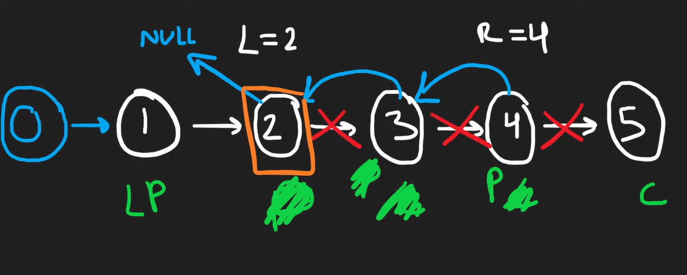

# Inplace reversal of a linkedlist

In a lot of problems, we are asked to reverse the links between a set of nodes of a LinkedList. Often, the constraint is that we need to do this in-place, i.e., using the existing node objects and without using extra memory. we will solve a bunch of problems using this pattern.

## Table of contents

| No  | Difficulty | `Inplace reversal of linkedlist`                                      |
| --- | ---------- | --------------------------------------------------------------------- |
| 01  | Easy       | [Reverse a linkedlist](#reverse-a-linkedlist)                         |
| 02  | Medium     | [Reverse a sublist](#reverse-a-sublist)                               |
| 03  | Medium     | [Reverse every K-element Sub-list](#reverse-every-k-element-sub-list) |

## Answers

### Reverse a linkedlist

[Problem Link](https://leetcode.com/problems/reverse-linked-list/) <br/>
Question : Given the head of a Singly LinkedList, reverse the LinkedList. Write a function to return the new head of the reversed LinkedList.<br/>
Solution : Given `1->2->3->null`, we’ll have to return `3->2->1->null`. We’ll create two variables previous and current and initialize them with None and head.

> 1.  Now we’ll replace the current node’s next to previous `current.next = previous`, and previous to current `previous = current`<br/> [ 1->null, previous = 1]. <br/>
> 2.  We’ll also have to store current’s next at first `nextnode = current.next` then replace the current node with nextnode to traverse the linkedlist

```python
def reverse(head):
    current = head, previous = None

    while current:
        nextnode = current.next
        current.next = previous
        previous = current
        current = nextnode

    return previous
```

<br/>**[⬆ Back to Top](#table-of-contents)**

### Reverse a sublist

[Problem Link](https://leetcode.com/problems/reverse-linked-list-ii/) <br/>
Question : Given the head of a LinkedList and two positions ‘p’ and ‘q’, reverse the LinkedList from position ‘p’ to ‘q’. <br/>
Solution : The problem follows the In-place Reversal of a LinkedList pattern. We can use a similar approach as discussed in Reverse a LinkedList. Here are the steps we need to follow:

> 1 : Skip the first p-1 nodes, to reach the node at position p.</br>
> 2 : Remember the node at position p-1 to be used later to connect with the reversed sub-list.</br>
> 3 : Next, reverse the nodes from p to q using the same approach discussed in Reverse a LinkedList.</br>
> 4 : Connect the p-1 and q+1 nodes to the reversed sub-list.

 <br/>

> **Note** : This problem needs visual representation, to understand it fully you should watch this [video](https://www.youtube.com/watch?v=RF_M9tX4Eag).

```python
def reverse_between(head, left, right):
    dummy = ListNode(0, head)

    # 1) reach node at position left
    leftPrev, curr = dummy, head
    for i in range (left-1):
        curr, leftPrev = curr.next, curr
    prev = None

    # Now curr = left, prevLeft = node before left
    # 2) Reverse from left to right
    for i in range (right-left+1):
        tmpNext = curr.next
        curr.next, prev = prev, curr
        curr = tmpNext

    # 3) Update positions
    leftPrev.next.next = curr # curr is node after right
    leftPrev.next = prev # prev is right

    return dummy.next
```

<br/>**[⬆ Back to Top](#table-of-contents)**

### Reverse every K-element Sub-list

[Problem Link]() <br/>
Question : Given the head of a LinkedList and a number ‘k’, reverse every ‘k’ sized sub-list starting from the head. If, in the end, you are left with a sub-list with less than ‘k’ elements, reverse it too. <br/>
Solution : Coming soon !

<br/>**[⬆ Back to Top](#table-of-contents)**
