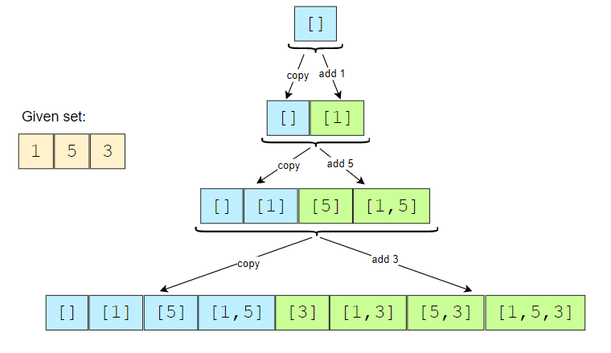
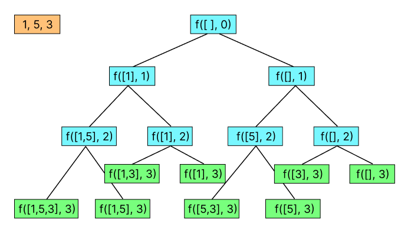
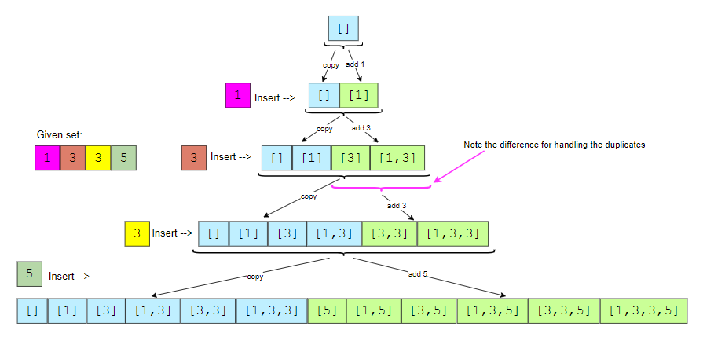

# Subsets

A huge number of coding interview problems involve dealing with Permutations and Combinations of a given set of elements. This pattern describes an efficient Breadth First Search (BFS) approach to handle all these problems.

## Table of contents

| No  | Difficulty | `Subsets`                                           |
| --- | ---------- | --------------------------------------------------- |
| 01  | Medium     | [Subsets](#subsets)                                 |
| 02  | Medium     | [Subsets with duplicates](#subsets-with-duplicates) |

## Answers

### Subsets

[Problem Link](https://leetcode.com/problems/subsets/) <br/>
Question : Given a set with distinct elements, find all of its distinct subsets.<br/>
Solution 1: Let's say given input is `[1,5,3]` We can start with `res = [[]]` now we we'll add 1 in every array inside of res. now `res = [[],[1]]` we'll do similar process for the rest of elements in input array

 <br/>

```python
def subsets(nums):
    subsets = [[]]

    for n in nums:
        for i in range(len(subsets)):
            currSet = subsets[i].copy()
            currSet.append(n)
            subsets.append(currSet)

    return subsets
```

Solution 2: With a current output array we'll maintain `i` variable which will indicate our current number in nums array. for each `nums[i]` we can either add it to current output or we don't add it.

 <br/>

```python
def subsets(nums):

    res = []
    def backtrack(out, i):
        if i == len(nums): return res.append(out.copy())

        out.append(nums[i])
        backtrack(out, i+1)

        out.pop()
        backtrack(out, i+1)

    backtrack([], 0)
    return res
```

<br/>**[⬆ Back to Top](#table-of-contents)**

### Subsets with duplicates

[Problem Link](https://leetcode.com/problems/subsets-ii/) <br/>
Question : Given an integer array nums that may contain duplicates, return all possible subsets.<br/>
Solution 1: See below picture how are we going to handle whenever we encounter a duplicate

 <br/>

```python
def subsets2(nums):
    nums.sort()

    res, prevEnd = [[]], 0
    for i in range(len(nums)):
        startIdx = 0
        if i > 0 and nums[i] == nums[i-1]: startIdx = prevEnd

        prevEnd = len(res)
        for j in range(startIdx, prevEnd):
            cur = res[j].copy()
            cur.append(nums[i])
            res.append(cur)

    return res
```

Solution 2: Similar to previous backtracking approach we can either add a number or do not add a number but after adding a number if we get the same number in next index we don't consider it. So while `nums[i] == nums[i+1]` we'll not call `f(out, i+1)`

```python
def subsetsWithDup(nums):
     nums.sort()

     res = []
     def backtrack(out, i):
         if i == len(nums):return res.append(out.copy())

         out.append(nums[i])
         backtrack(out, i+1)
         out.pop()

         j = i
         while j < len(nums)-1 and nums[j] == nums[j+1]:
             j += 1
         backtrack(out, j+1)

     backtrack([], 0)
     return res
```

<br/>**[⬆ Back to Top](#table-of-contents)**
